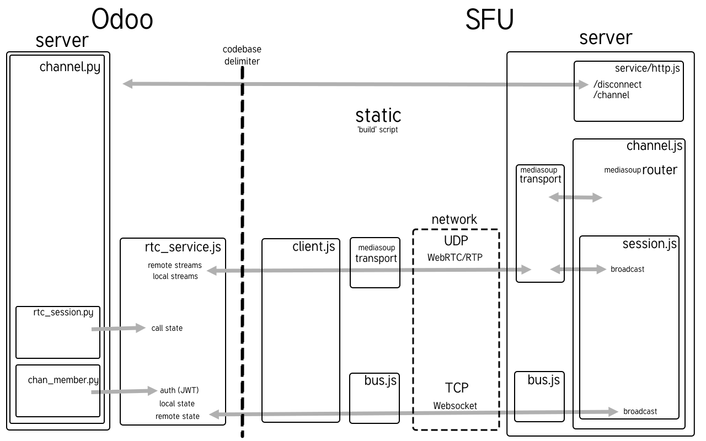

# Odoo SFU

## Overview

Contains the code for the SFU (Selective Forwarding Unit) server 
used in [Odoo Discuss](https://www.odoo.com/app/discuss). The SFU server is responsible for handling the WebRTC connections
between users and providing channels to coordinate these connections.

The server is not stand-alone, it does not serve any HTML or any interface code for calls. It only contains
the SFU and a [client bundle/library](#client-api-bundle) to connect to it.

## Prerequisites
- [Node.js 20.9.0 (LTS)](https://nodejs.org/)

## Before deployment

Build the client bundle

 ```bash
     npm install
     npm run build
 ```

Once the bundle is built, it can be added to the assets of your main server, and
interacted with as described [here](#client-api-bundle).

## Deployment

1. Install dependencies.
    ```bash
        npm ci -omit=dev
    ```
2. Run the SFU server.
    ```bash
        npm PROXY=1 PUBLIC_IP=134.123.222.111 AUTH_KEY=u6bsUQEWrHdKIuYplirRnbBmLbrKV5PxKG7DtA71mng= run start
    ```

The available environment variables are:

- **PUBLIC_IP** (required): used to establish webRTC connections to the server
- **AUTH_KEY** (required): the base64 encoded encryption key used for authentication
- **HTTP_INTERFACE**:  HTTP/WS interface, defaults to "0.0.0.0" (listen on all interfaces)
- **PORT**: port for HTTP/WS, defaults to standard ports
- **RTC_INTERFACE**: Interface address for RTC, defaults to "0.0.0.0"
- **PROXY**: set if behind a proxy, the proxy must properly implement "x-forwarded-for", "x-forwarded-proto" and "x-forwarded-host"
- **AUDIO_CODECS**: comma separated list of audio codecs to use, default to all available
- **VIDEO_CODECS**: comma separated list of video codecs to use, default to all available
- **RTC_MIN_PORT**: Lower bound for the range of ports used by the RTC server, must be open in both TCP and UDP
- **RTC_MAX_PORT**: Upper bound for the range of ports used by the RTC server, must be open in both TCP and UDP
- **MAX_BUF_IN**: if set, limits the incoming buffer size per session (user)
- **MAX_BUF_OUT**: if set, limits the outgoing buffer size per session (user)
- **MAX_BITRATE_IN**: if set, limits the incoming bitrate per session (user)
- **MAX_BITRATE_OUT**: if set, limits the outgoing bitrate per session (user)
- **CHANNEL_SIZE**: the maximum amount of users per channel, defaults to 100
- **WORKER_LOG_LEVEL**: "none" | "error" | "warn" | "debug", will only work if `DEBUG` is properly set.
- **LOG_LEVEL**: "none" | "error" | "warn" | "info" | "debug" | "verbose"
- **LOG_TIMESTAMP**: adds a timestamp to the log lines, defaults to true, to disable it, set to "disable", "false", "none", "no" or "0"
- **LOG_COLOR**: If set, colors the log lines based on their level
- **DEBUG**: an env variable used by the [debug](https://www.npmjs.com/package/debug) module. e.g.: `DEBUG=*`, `DEBUG=mediasoup*`


See [config.js](./src/config.js) for more details and examples.

## Binding the SFU and the Odoo server together

### On the SFU
Set the `AUTH_KEY` env variable with  the base64 encryption key that can be used to authenticate connections to the server.

### On Odoo 
Go to the Discuss settings and configure the `RTC Server URL` and `RTC server KEY` fields. The `RTC server KEY`
must be the same base64 encoded string as `AUTH_KEY` on the SFU server.

## Interacting with the SFU server

The SFU server responds to the following IPC signals:

- `SIGFPE(8)`: Restarts the server.
- `SIGALRM(14)`: Initiates a soft reset by closing all sessions, but keeps services alive.
- `SIGIO(29)`: Prints server statistics, such as the number of channels, sessions, bitrate.

See [server.js](./src/server.js) for more details.

## HTTP API

- GET `/v1/stats`: returns the server statistics as an array with one entry per channel, in JSON:
    ```json
    [
        {
            "createDate": "2023-10-25T04:57:45.453Z",
            "uuid": "86079c25-9cf8-4d58-9dea-cef44cf845e2",
            "remoteAddress": "whoever-requested-the-room.com",
            "sessionsStats": {
                "incomingBitRate": {
                    "audio": 5,
                    "camera": 700000,
                    "screen": 0,
                    "total": 700005
                    },
                "count": 3,
                "cameraCount": 2,
                "screenCount": 0
            },
            "webRtcEnabled": true
        }
    ]
    ```
- GET `/v1/channel`: create a channel and returns information required to connect to it in JSON:
   ```json
   {
      "uuid": "31dcc5dc-4d26-453e-9bca-ab1f5d268303",
      "url": "https://example-odoo-sfu.com"
  }
  ```

- POST `/v1/disconnect` disconnects sessions, expects the body to be a Json Web Token formed as such:
    ```js
  jwt.sign(
    {
      "sessionIdsByChannel": {
        [channelUUID]: [sessionId1, sessionId2]
      }
    },
    "HS256",
  );
    ```

See [http.js](./src/services/http.js) for more details.

## Client API (bundle)

The bundle built with the `build` script in [package.json](./package.json) can be imported
in the client(js) code that implements the call feature like this:

```js
import { SfuClient, SFU_CLIENT_STATE } from "/bundle/odoo_sfu.js";
const sfu = new SfuClient();
```
`SfuClient` exposes the following API:

- connect()
    ```js
    sfu.connect("https://my-sfu.com", jsonWebToken, { iceServers });
    ```
- disconnect()
    ```js
    sfu.disconnect();
    sfu.state === SFU_CLIENT_STATE.DISCONNECTED; // true
    ```
- updateUpload()
    ```js
    const audioStream = await window.navigator.mediaDevices.getUserMedia({
        audio: true,
    });
    const audioTrack = audioStream.getAudioTracks()[0];
    await sfu.updateUpload("audio", audioTrack); // we upload a new audio track to the server
    await sfu.updateUpload("audio", undefined); // we stop uploading audio
    ```
- updateDownload()
    ```js
    sfu.updateDownload(remoteSessionId, {
        camera: false, // we want to stop downloading their camera
        screen: true, // we want to download their screen
    });
    ```
- updateInfo()
    ```js
    sfu.updateInfo({
        isMuted: true,
        isCameraOn: false,
        // ...
    });
    ```
- getStats()
    ```js
    const { uploadStats, downloadStats, ...producerStats } = await sfu.getStats();
    typeof uploadStats === "RTCStatsReport"; // true
    typeof producerStats["camera"] === "RTCStatsReport"; // true
    // see https://w3c.github.io/webrtc-pc/#rtcstatsreport-object
    ```
- @fires "update"
    ```js
    sfu.addEventListener("update", ({ detail: { name, payload } }) => {
        switch (name) {
            case "track":
                {
                    const { sessionId, type, track, active } = payload;
                    const remoteParticipantViewer = findParticipantById(sessionId);
                    if (type === "camera") {
                        remoteParticipantViewer.cameraTrack = track;
                        remoteParticipantViewer.isCameraOn = active; // indicates whether the track is active or paused
                    }
                }
                return;
            // ...
        }
    });
    ```
- @fires "stateChange"
    ```js
    sfu.addEventListener("stateChange", ({ detail: { state, cause } }) => {
        switch (state) {
            case SFU_CLIENT_STATE.CONNECTED:
                console.log("Connected to the SFU server.");
                // we can start uploading now
                client.updateUpload("audio", myMicrophoneTrack);
                client.updateUpload("camera", myWebcamTrack);
                break;
            case SFU_CLIENT_STATE.CLOSED:
                console.log("Connection to the SFU server closed.");
                break;
            // ...
        }
    });
    ```

see [client.js](./src/client.js) for more details.

## Architecture


