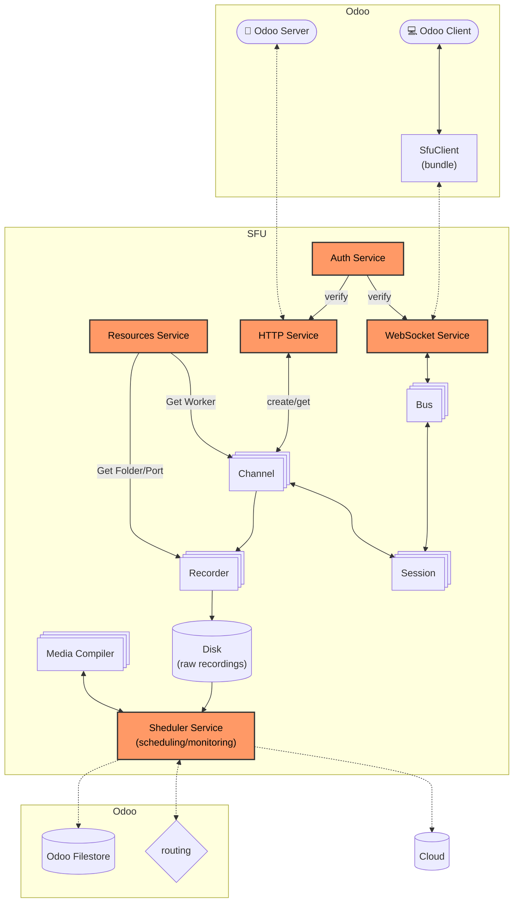
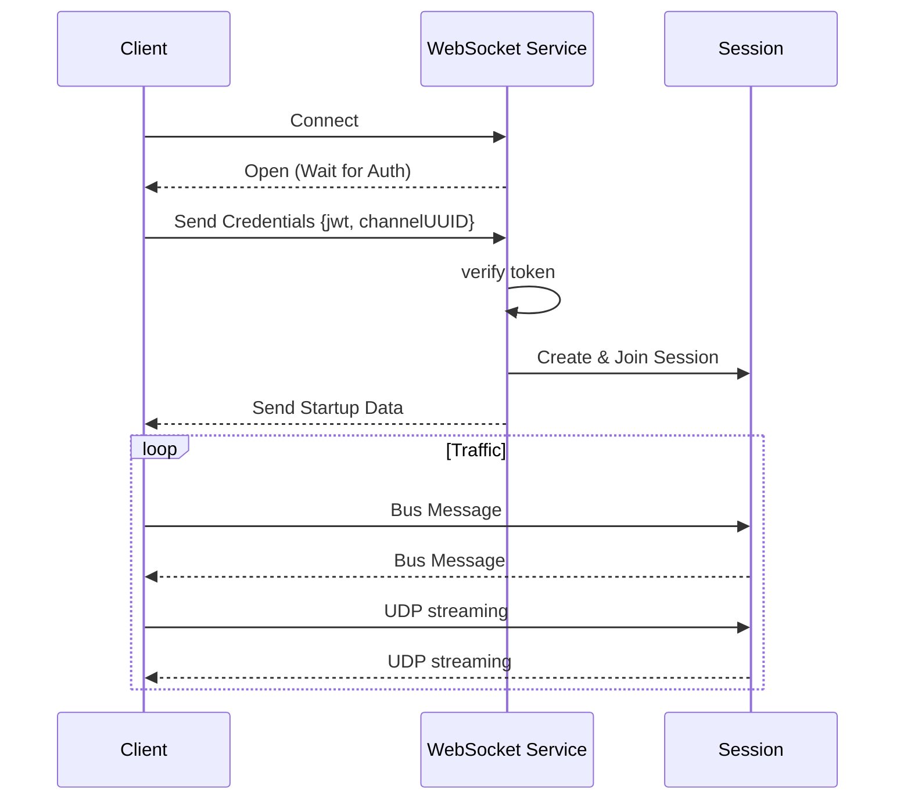

# Architecture

// TODO: remaining things to write:
// channel segregation with key (multiple server can use the same sfu with different keys)
// "Media" service is outdated, it is now "Scheduler"

## Services

Services are the main element of the SFU runtime, they are live for the whole duration of the SFU process.

### 1. Auth Service ([`auth.ts`](../src/core/services/auth.ts))

The Authentication service handle keys, the signing and verification of JWTs and encryption/decryption.

### 2. HTTP Service ([`http.ts`](../src/core/services/http.ts))
more at [http.md](./http.md)

The HTTP service provides the REST API for the SFU, intended to be used by other (odoo) servers (and server managers). It handles channel creation, status checks, and session management.

### 3. WebSocket Service ([`ws.ts`](../src/core/services/ws.ts))

The WebSocket service manages real-time, persistent connections with clients. It is the primary transport for signaling data once a session is established, and use to setup the rtc connections.

### 4. Resources Service ([`resources.ts`](../src/core/services/resources.ts))

The Resources service mannages the pool of worker processes and system resources.

-  Managers the pool of Mediasoup workers and balanse their load.
-  Manages disk usage (folders, space, cleanup...).
-  Manages dynamic ports for media transport.

### 5. Scheduler Service ([`scheduler.ts`](../src/recording/services/scheduler.ts))
more at [recording.md](./recording.md)

The scheduler service is responsible for the processing of recordings and the upload to the destination server.

## Models

### 1. Channel ([`channel.ts`](../src/core/models/channel.ts))

The `Channel` represents a room or lobby where multiple users can connect (typically mirrors Odoo's "discuss.channel" model).

It is isolated from other channels and can be protected by it own key

- **Session Management**: Maintains the list of active `Session`s.
- **Media Router**: Creates and holds the mediasoup `Router` instance used for media routing within the channel.
- **Recording**: Manages the `Recorder` instance if recording is enabled.
- **Signaling**: Serves as a relay for signaling messages and broadcasts between clients.

### 2. Session ([`session.ts`](../src/core/models/session.ts))

The `Session` represents a single connected user/client within a `Channel`. It encapsulates the state and resources associated with a specific participant.

- **WebRTC Transports**: Manages both Send (producer) and Receive (consumer) WebRTC transports.
- **Media Handling**: Handles media `Producer`s (Audio, Video, Screen) and `Consumer`s.
- **Signaling**: Manages signaling traffic via the `Bus`.
- **Permissions**: Scopes permissions for active features like recording/video-recording.

### 3. Recording Models
see [recording.md](./recording.md)
