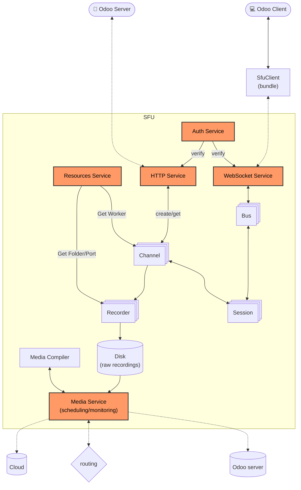
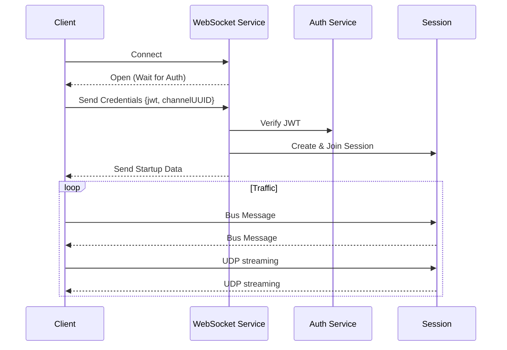

# Architecture

The SFU is divided into [services](../src/services), each responsible for a specific functionality of the server. And models [models](../src/models) for the data structures used by the services.

## Overview

## Service Modules

### 1. Auth Service ([`auth.ts`](../src/services/auth.ts))

The Authentication service is responsible for the security of the application. It handles the signing and verification of JSON Web Tokens (JWT).

### 2. HTTP Service ([`http.ts`](../src/services/http.ts))
more at [http.md](./http.md)

The HTTP service provides the REST API for the SFU. It handles channel creation, status checks, and session management.

### 3. WebSocket Service ([`ws.ts`](../src/services/ws.ts))

The WebSocket service manages real-time, persistent connections with clients. It is the primary transport for signaling data once a session is established.

### 4. Resources Service ([`resources.ts`](../src/services/resources.ts))

The Resources service acts as the interface to the underlying system and Mediasoup library. It manages the pool of worker processes and system resources.

**Responsibilities:**
- **Worker Management**: Maintains a pool of Mediasoup workers. Automatically replaces workers if they crash.
- **Load Balancing**: `getWorker()` returns the worker with the lowest memory usage (`ru_maxrss`).
- **File System**: Manages temporary folders for recordings via the `Folder` class.
- **Port Management**: Allocates dynamic ports for media transport using the `DynamicPort` class.

### 5. Media Service ([`media.ts`](../src/services/media.ts))
more at [recording.md](./recording.md)

The Media service is responsible for the processing and dispatching of media files (recordings) and the scheduling of these tasks.

## Models

### 1. Channel ([`channel.ts`](../src/models/channel.ts))

The `Channel` represents a room or lobby where multiple users can connect. It acts as the central hub for a group of participants.

- **Session Management**: Maintains the list of active `Session`s.
- **Media Router**: Creates and holds the mediasoup `Router` instance used for media routing within the channel.
- **Recording**: Manages the `Recorder` instance if recording is enabled.
- **Signaling**: Serves as a relay for signaling messages between clients.

### 2. Session ([`session.ts`](../src/models/session.ts))

The `Session` represents a single connected user/client within a `Channel`. It encapsulates the state and resources associated with a specific participant.

- **WebRTC Transports**: Manages both Send (producer) and Receive (consumer) WebRTC transports.
- **Media Handling**: Handles media `Producer`s (Audio, Video, Screen) and `Consumer`s.
- **Signaling**: Manages signaling traffic via the `Bus`.
- **Permissions**: Scopes permissions for active features like recording/video-recording.

### 3. Recording Models
see [recording.md](./recording.md)