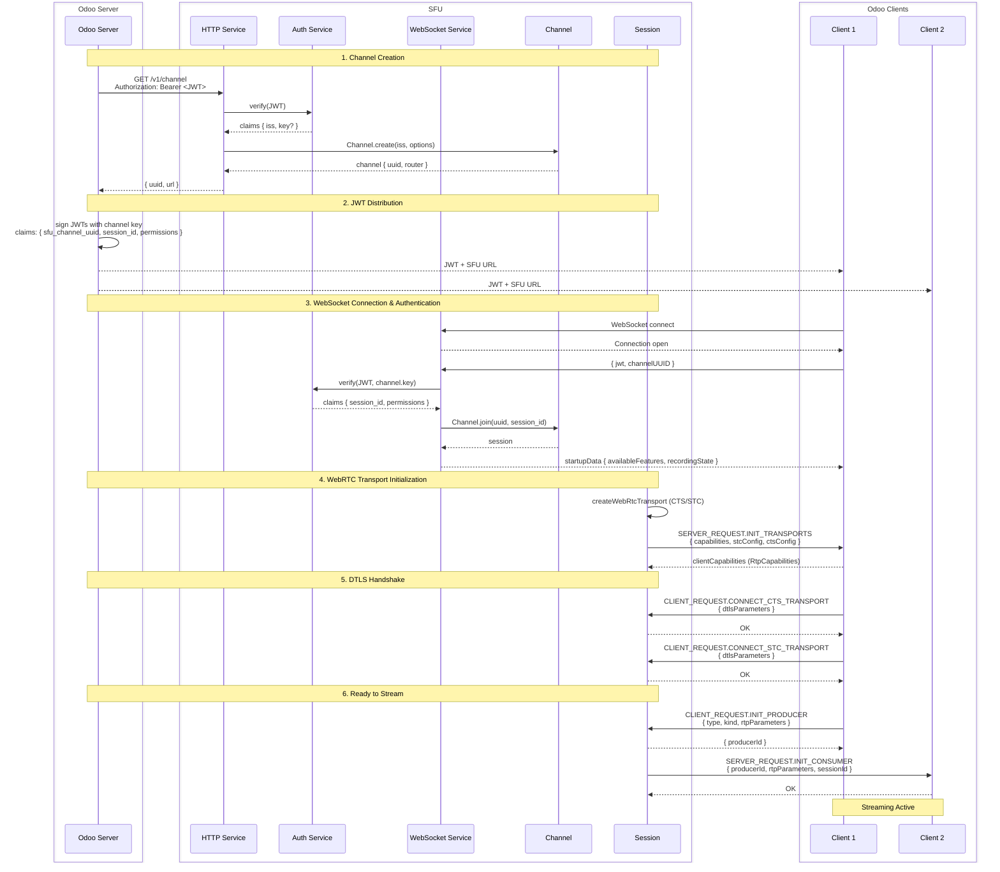

# Core Network Flow



## Flow Steps

### 1. Channel Creation

The Odoo server initiates a channel by calling `GET /v1/channel` with a signed (with the AUTH_KEY) JWT in the `Authorization` header.

The SFU:
1. Verifies the JWT using the global `AUTH_KEY`
2. Creates (or retrieves) a channel identified by the `iss` claim
3. If a `key` is provided, it's associated to the channel for futur authentication

reponds with:
```json
{
  "uuid": "31dcc5dc-4d26-453e-9bca-ab1f5d268303", // the uuid of the channel
  "url": "https://sfu.example.com" // the url of the sfu for the clients
  // the reason we serve the URL is because it makes it easier to implement load balancing with the same API
}
```

### 2. JWT Distribution

The Odoo server uses the channel `uuid` and the optional `key` (fallback to global `AUTH_KEY`) to sign JWTs for its clients. These JWTs are distributed to clients along with the SFU URL.

Note: the diference between `key` and `AUTH_KEY` is that the `key` is specific to the channel, while `AUTH_KEY` is global. `key` is exchanged when requesting the channel and is only known by the specific Odoo server that
requested the associated channel (this is useful when the SFU has multiple Odoo servers behind it and needs to authenticate clients from different servers, like for SaaS/Odoo.sh).

**JWT Claims for Clients:**
```json
{
  "sfu_channel_uuid": "<channel-uuid>",
  "session_id": "<unique-session-id>",
  "label": "User Name",
  "permissions": {
    "recording": true,
    "videoRecording": false
  }
}
```

### 3. WebSocket Connection & Authentication

Clients connect to the SFU via WebSocket and authenticate with their JWT.

**Connection Flow:**
1. Client opens WebSocket connection to `wss://sfu.example.com`
2. Client sends credentials as first message:
   ```json
   { "jwt": "<signed-jwt>", "channelUUID": "<uuid>" }
   ```
   returns:
   ```json
   {
     "availableFeatures": {
       "rtc": false,
        "transcription": false,
        "audioRecording": false,
        "videoRecording": false
     },
     "recordingState": null
   }
   ```

### 4. WebRTC Transport Initialization

Once authenticated, the session initializes WebRTC transports:

1. FU creates two transports:
   - Client-to-Server (CTS): receives media from client (producers)
   - Server-to-Client (STC): sends media to client (consumers)
2. SFU sends transport configs to client:
3. Client responds with RTP capabilities
4. SFU finalizes the transport with the known capabilities
5. rtc session state changes to "connected", the client is ready to stream (upload streams)

### 5. DTLS Handshake

The client exchange device information with the serve
the webrtc connection

### 6. Ready to Stream
