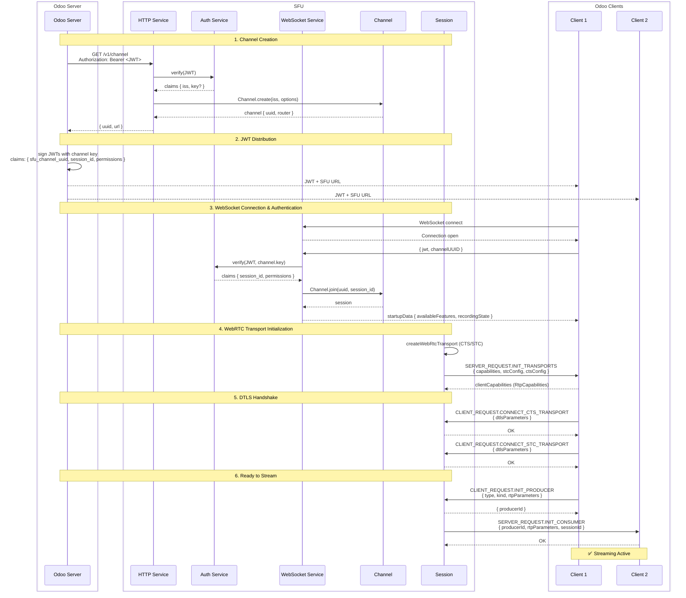

# Core Network Flow

This document describes the complete flow from channel creation to an active WebRTC streaming session.



## Flow Steps

### 1. Channel Creation

The Odoo server initiates a channel by calling `GET /v1/channel` with a signed JWT in the `Authorization` header.

**Request:**
- **Header**: `Authorization: Bearer <JWT>`
  - JWT must contain `iss` (issuer) claim for idempotency
  - Optional `key` claim for channel-specific authentication
- **Query params** (optional):
  - `webRTC=true|false` — enables/disables WebRTC (default: true)
  - `recordingAddress` — enables recording with specified callback URL

**Response:**
```json
{
  "uuid": "31dcc5dc-4d26-453e-9bca-ab1f5d268303",
  "url": "https://sfu.example.com"
}
```

The SFU:
1. Verifies the JWT using the global `AUTH_KEY`
2. Creates (or retrieves) a channel identified by the `iss` claim
3. If a `key` is provided, it's stored for client authentication

### 2. JWT Distribution

The Odoo server uses the channel `uuid` and the optional `key` to sign JWTs for its clients. These JWTs are distributed to clients along with the SFU URL.

**JWT Claims for Clients:**
```json
{
  "sfu_channel_uuid": "<channel-uuid>",
  "session_id": "<unique-session-id>",
  "label": "User Name",
  "permissions": {
    "recording": true,
    "videoRecording": false
  }
}
```

### 3. WebSocket Connection & Authentication

Clients connect to the SFU via WebSocket and authenticate with their JWT.

**Connection Flow:**
1. Client opens WebSocket connection to `wss://sfu.example.com`
2. Client sends credentials as first message:
   ```json
   { "jwt": "<signed-jwt>", "channelUUID": "<uuid>" }
   ```
3. SFU verifies JWT using channel's key (or global key if none)
4. SFU creates/joins session and sends startup data:
   ```json
   {
     "availableFeatures": {
       "rtc": true,
       "recording": false,
       "videoRecording": false
     },
     "recordingState": null
   }
   ```

### 4. WebRTC Transport Initialization

Once authenticated, the session initializes WebRTC transports:

1. **SFU creates two transports:**
   - **CTS (Client-to-Server)**: receives media from client (producers)
   - **STC (Server-to-Client)**: sends media to client (consumers)

2. **SFU sends transport configs to client:**
   ```json
   {
     "capabilities": { /* Router RTP capabilities */ },
     "ctsConfig": { "id": "...", "iceParameters": {...}, "iceCandidates": [...], "dtlsParameters": {...} },
     "stcConfig": { "id": "...", "iceParameters": {...}, "iceCandidates": [...], "dtlsParameters": {...} }
   }
   ```

3. **Client responds with RTP capabilities**

### 5. DTLS Handshake

The client completes the secure connection by exchanging DTLS parameters:

1. `CLIENT_REQUEST.CONNECT_CTS_TRANSPORT` — connects the upload transport
2. `CLIENT_REQUEST.CONNECT_STC_TRANSPORT` — connects the download transport

### 6. Ready to Stream

With transports connected, the client can:

- **Produce media**: `CLIENT_REQUEST.INIT_PRODUCER` to start sending audio/video/screen
- **Consume media**: SFU automatically creates consumers for other sessions' producers

The session is now fully connected and streaming.

## Key Components

| Component                                       | Role                                                 |
| ----------------------------------------------- | ---------------------------------------------------- |
| [HTTP Service](../src/core/services/http.ts)    | REST API for server-to-server communication          |
| [Auth Service](../src/core/services/auth.ts)    | JWT signing and verification                         |
| [WebSocket Service](../src/core/services/ws.ts) | Client connections and authentication                |
| [Channel](../src/core/models/channel.ts)        | Room management and media routing                    |
| [Session](../src/core/models/session.ts)        | Per-client WebRTC transports and producers/consumers |

## Security Model

```
┌─────────────────────────────────────────────────────────────┐
│                      Global AUTH_KEY                        │
│   Used for: Server-to-SFU authentication (/v1/channel)      │
└─────────────────────────────────────────────────────────────┘
                              │
                              ▼
┌─────────────────────────────────────────────────────────────┐
│                    Channel Key (optional)                   │
│   Provided in: JWT claim "key" during channel creation      │
│   Used for: Client-to-SFU authentication (WebSocket)        │
│   Benefit: Channel isolation - compromised key only         │
│            affects one channel                              │
└─────────────────────────────────────────────────────────────┘
```

- **Without channel key**: Clients authenticate using the global `AUTH_KEY`
- **With channel key**: Clients authenticate using the channel-specific key, providing isolation between channels (this is useful when deploying one SFU for multiple tenants)
