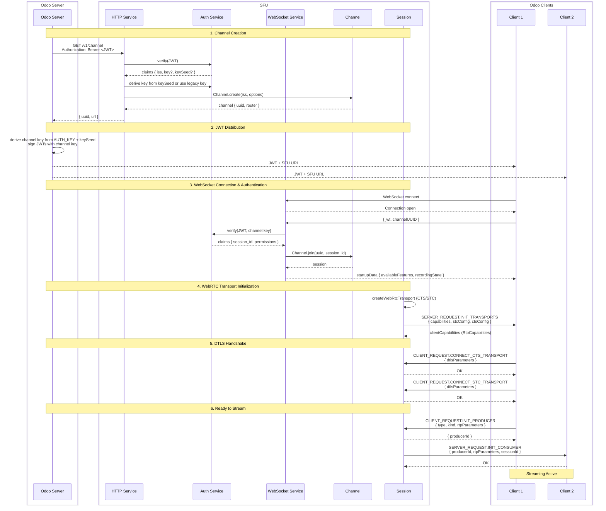

# Core Network Flow


```mermaid
sequenceDiagram
    box Odoo Server
        participant OS as Odoo Server
    end
    box SFU
        participant HTTP as HTTP Service
        participant Auth as Auth Service
        participant WS as WebSocket Service
        participant Ch as Channel
        participant Sess as Session
    end
    box Odoo Clients
        participant C1 as Client 1
        participant C2 as Client 2
    end

    Note over OS,Sess: 1. Channel Creation
    OS->>HTTP: GET /v1/channel<br>Authorization: Bearer <JWT>
    HTTP->>Auth: verify(JWT)
    Auth-->>HTTP: claims { iss, key?, keySeed? }
    HTTP->>Auth: derive key from keySeed or use legacy key
    HTTP->>Ch: Channel.create(iss, options)
    Ch-->>HTTP: channel { uuid, router }
    HTTP-->>OS: { uuid, url }

    Note over OS,Sess: 2. JWT Distribution
    OS->>OS: derive channel key from AUTH_KEY + keySeed<br>sign JWTs with channel key
    OS-->>C1: JWT + SFU URL
    OS-->>C2: JWT + SFU URL

    Note over OS,Sess: 3. WebSocket Connection & Authentication
    C1->>WS: WebSocket connect
    WS-->>C1: Connection open
    C1->>WS: { jwt, channelUUID }
    WS->>Auth: verify(JWT, channel.key)
    Auth-->>WS: claims { session_id, permissions }
    WS->>Ch: Channel.join(uuid, session_id)
    Ch-->>WS: session
    WS-->>C1: startupData { availableFeatures, recordingState }

    Note over OS,Sess: 4. WebRTC Transport Initialization
    Sess->>Sess: createWebRtcTransport (CTS/STC)
    Sess->>C1: SERVER_REQUEST.INIT_TRANSPORTS<br>{ capabilities, stcConfig, ctsConfig }
    C1-->>Sess: clientCapabilities (RtpCapabilities)

    Note over OS,Sess: 5. DTLS Handshake
    C1->>Sess: CLIENT_REQUEST.CONNECT_CTS_TRANSPORT<br>{ dtlsParameters }
    Sess-->>C1: OK
    C1->>Sess: CLIENT_REQUEST.CONNECT_STC_TRANSPORT<br>{ dtlsParameters }
    Sess-->>C1: OK

    Note over OS,Sess: 6. Ready to Stream
    C1->>Sess: CLIENT_REQUEST.INIT_PRODUCER<br>{ type, kind, rtpParameters }
    Sess-->>C1: { producerId }
    Sess->>C2: SERVER_REQUEST.INIT_CONSUMER<br>{ producerId, rtpParameters, sessionId }
    C2-->>Sess: OK

    Note over C1,C2: Streaming Active
```

## Flow Steps

### 1. Channel Creation

The Odoo server initiates a channel by calling `GET /v1/channel` with a signed (with the AUTH_KEY) JWT in the `Authorization` header.

The SFU:
1. Verifies the JWT using the global `AUTH_KEY`
2. Creates (or retrieves) a channel identified by the `iss` claim
3. Derives the channel key from `keySeed` or uses the legacy `key` claim

reponds with:
```json
{
  "uuid": "31dcc5dc-4d26-453e-9bca-ab1f5d268303", // the uuid of the channel
  "url": "https://sfu.example.com" // the url of the sfu for the clients
  // the reason we serve the URL is because it makes it easier to implement load balancing with the same API
}
```

### 2. JWT Distribution

The Odoo server derives the same channel key from `AUTH_KEY` and `keySeed`, then uses the channel `uuid` and derived key to sign JWTs for its clients. These JWTs are distributed to clients along with the SFU URL.

`keySeed` is specific to the Odoo channel. The derived key never crosses the Odoo-to-SFU connection and cannot be computed from the seed without the global `AUTH_KEY`. The legacy `key` claim remains supported for compatibility and accepts the risk of sending the channel key over the connection. If both claims are present, `keySeed` takes precedence.

**JWT Claims for Clients:**
```json
{
  "exp": 4102444800,
  "sfu_channel_uuid": "<channel-uuid>",
  "session_id": "<unique-session-id>",
  "label": "User Name",
  "permissions": {
    "recording": true,
    "videoRecording": false
  }
}
```

### 3. WebSocket Connection & Authentication

Clients connect to the SFU via WebSocket and authenticate with their JWT.

**Connection Flow:**
1. Client opens WebSocket connection to `wss://sfu.example.com`
2. Client sends credentials as first message:
   ```json
   { "jwt": "<signed-jwt>", "channelUUID": "<uuid>" }
   ```
   returns:
   ```json
   {
     "availableFeatures": {
       "rtc": false,
        "transcription": false,
        "audioRecording": false,
        "videoRecording": false
     },
     "recordingState": null
   }
   ```

### 4. WebRTC Transport Initialization

Once authenticated, the session initializes WebRTC transports:

1. FU creates two transports:
   - Client-to-Server (CTS): receives media from client (producers)
   - Server-to-Client (STC): sends media to client (consumers)
2. SFU sends transport configs to client:
3. Client responds with RTP capabilities
4. SFU finalizes the transport with the known capabilities
5. rtc session state changes to "connected", the client is ready to stream (upload streams)

### 5. DTLS Handshake

The client exchange device information with the serve
the webrtc connection

### 6. Ready to Stream

can call updateupload / updatedownload
