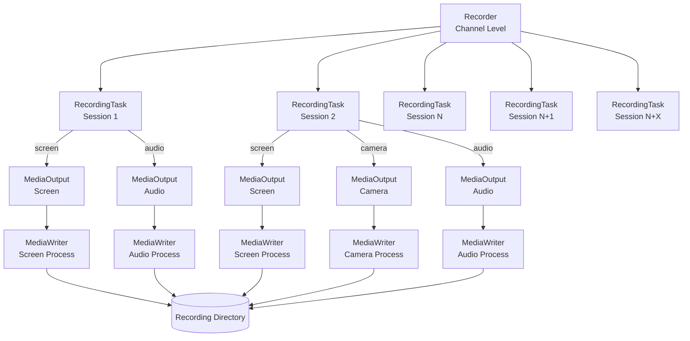

# Recording
see [media.ts](../src/recording/services/media.ts) and [recording/*](../src/recording/models) for more details.

The recording feature in the SFU allows for capturing audio, video from camera, and screen sharing streams from a channel. It is designed to handle each stream independently to produce raw recording files that can be processed later (e.g., for transcription, composition, or playback) (by thhe media service).

## Architecture

The recording architecture follows a hierarchical structure, managing resources from the channel level down to individual system processes.



### Components

1.  **Recorder (Channel Level)**
    *   **Scope:** Manages recording for an entire `Channel`.
    *   **Responsibility:** Handles the lifecycle of recording and holds the  `RecordingTask`s for current sessions and listens for new sessions joining the channel to create tasks for them dynamically.

2.  **RecordingTask (Session Level)**
    *   **Scope:** Bound to a specific rtc `Session`.
    *   **Responsibility:** Monitors the user's producers (audio, camera, screen). When a user releases a stream (e.g., turns on camera), the `RecordingTask` detects it and manage a `MediaOutput` for each.
    *   **Inputs:** `audio`, `camera`, `screen` flags determine which streams to record.

3.  **MediaOutput (Stream Level / RTP)**
    *   **Scope:** Handles a single stream type (e.g., just the camera) for a session.
    *   **Responsibility:** Bridges the Mediasoup `Producer` (source) to the `MediaWriter` (ffmpeg) process (sink), and manages the lifecycle of the port, transport, consumer, and ffmpeg process. It also handles thhe "allowed"/"active" flags.

4.  **MediaWriter (Process Level)**
    *   **Scope:** Represents a single child process writing to a file.
    *   **Responsibility:** Receives RTP packets on a specified port and writes them to a file container. Essentially a wrapper around the ffmpeg API.

## Output Structure

Recordings are saved in a directory `{channelUUID}/{timestamp}` inside `RECORDING_PATH`.

```text
{channelUUID}/{timestamp}/
├── metadata.json
├── audio/
│   └── {timestamp}-{sessionID}-{streamType}.webm
│   └── 1765292341216-987-audio.webm
│   └── 1765292441216-988-audio.webm
├── video/
│   └── {timestamp}-{sessionID}-{streamType}.webm
│   └── 1765292341216-985-video.mp4 // extension depends on codec
│   └── 1765292341219-987-video.webm
│   └── 1765292341219-987-video.log // if LOG_LEVEL=debug
└── screen/
    └── 1765292341216-987-screen.mp4
```

#### Contents:
*   **metadata.json:** Top-level metadata file containing timestamps and upload info.
*   **audio/:** Folder containing all audio stream recordings.
*   **video/:** Folder containing all camera stream recordings.
*   **screen/:** Folder containing all screen sharing stream recordings.

#### Metadata File (`metadata.json`)
// TODO: reminder, need to check when code is more stable, keys are not final

Contains the timestamps of the recording, and the address to which the file should be uploaded to.

```json
{
  "channelName": "discuss-channel-1234",
  "routingAddress": "http://www.oodo.com/discuss/recording/routing/1234",
  "video": true,
  "transcription": false,
  "startedAt": 1670000000000,
  "stoppedAt": 1670000060000,
  "timeStamps": [
    {
      "tag": "file_state_change",
      "timestamp": 1670000005000,
      "info": {
        "filename": "session-123-audio-167...webm",
        "type": "audio",
        "active": true
      }
    },
    ...
  ]
}
```
The first occurence of `file_state_change` with `active: true` marks the start of a file, and the last one with `active: false` marks the end, 
each file can have any arbitrary amount of state changes, when not active the content is essentially empty but the inner timestamps are still being marked.

## Media Service & Post-Processing

While the **Recorder** handles the real-time capture of streams, the **Media Service** is responsible for the asynchronous post-processing of these raw files.

### 1. [Media Service](../src/recording/services/media.ts)

TODO

### 2. [Media Compiler](../src/recording/models/media_compiler.ts)

The compiler transforms raw recording files into compiled recordings.

#### Upload
TODO: not decided yet, waiting on PR: https://github.com/odoo/odoo/pull/233836

After compilation, the service is responsible for uploading the generated artifacts based on the routing information obtained from the `routingAddress`.
