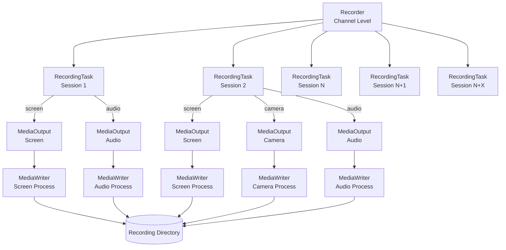

# Recording
see [recording/*](../src/recording) for more details.

The SFu can record streams from a channel (depending on permissions and sfu setup). 

Recording happens in two steps:
1) each streams is recorded in real time individually (the "raw recording").
2) later, the raw recordings are processed to produce one "combination" file.

The two phase approach allow for the real time part to be light (only writing packets to file, no transcoding), and then the compiling phase (composition/mixing and transcoding) can be done later with no real time constraint (so the heavy work can be done when the SFU is not under too much load).

## Architecture



### Components

1.  **Recorder (Channel Level)**
    Manages recording for an entire `Channel`.
    Handles the lifecycle of recording and holds the  `RecordingTask`s for current sessions and listens for new sessions joining the channel to create tasks for them dynamically.

2.  **RecordingTask (Session Level)**
    Bound to a specific rtc `Session`.
    Monitors the user's producers (audio, camera, screen). When a user releases a stream (e.g., turns on camera), the `RecordingTask` detects it and manage a `MediaOutput` for each.
    *   **Inputs:** `audio`, `camera`, `screen` flags determine which streams to record.

3.  **MediaOutput (Stream Level / RTP)**
    Handles a single stream type (e.g., just the camera) for a session.
    Bridges the Mediasoup `Producer` (source) to the `MediaWriter` (ffmpeg) process (sink), and manages the lifecycle of the port, transport, consumer, and ffmpeg process. It also handles thhe "allowed"/"active" flags.
*   
// TODO allowed/active when more stable

1.  **MediaWriter (Process Level)**
    Represents a single child process writing to a file.
    Receives RTP packets on a specified port and writes them to a file container. Essentially a wrapper to abstract ffmpeg.

## Output Structure

Recordings are saved in a directory `{channelUUID}/{timestamp}` inside `config.dir.recordings` (`${DATA_PATH}/recordings`).

```text
{channelUUID}/{timestamp}/
├── metadata.json
├── audio/
│   └── {timestamp}-{sessionID}-{streamType}.webm
│   └── 1765292341216-987-audio.webm
│   └── 1765292441216-988-audio.webm
├── video/
│   └── {timestamp}-{sessionID}-{streamType}.webm
│   └── 1765292341216-985-video.mp4 // extension depends on codec
│   └── 1765292341219-987-video.webm
│   └── 1765292341219-987-video.log // if LOG_LEVEL=debug
└── screen/
    └── 1765292341216-987-screen.mp4
```

#### Metadata File (`metadata.json`)
// TODO: reminder, need to check when code is more stable, keys are not final (may contain more than needed while im debugging/developing), need to wait for the call artifact PR to be merged to know exactly what will be needed.

Contains the timestamps of the recording, and the address to which the file should be uploaded to.

```json
{
  "channelName": "discuss-channel-1234",
  "routingAddress": "http://www.oodo.com/discuss/recording/routing/1234",
  "video": true,
  "transcription": false,
  "startedAt": 1670000000000,
  "stoppedAt": 1670000060000,
  "timeStamps": [
    {
      "tag": "file_state_change",
      "timestamp": 1670000005000,
      "info": {
        "filename": "session-123-audio-167...webm",
        "type": "audio",
        "active": true
      }
    },
    ...
  ]
}
```
The first occurence of `file_state_change` with `active: true` marks the start of a file, and the last one with `active: false` marks the end, 
each file can have any arbitrary amount of state changes, when not active the content is essentially empty.

note: the timestamp are the source of truth, a file can span over a period of time during which its underlying stream atlernate between active/inactive (will just be no sound / no video) because we do not estroy/rebuild the recording process for each state change (would lead to loss/latency, and an empty segment does not take much space).

## Sheduler Service & Post-Processing

While the **Recorder** handles the real-time capture of streams, the **Scheduler Service** is responsible for the asynchronous post-processing of these raw files.

### 1. [Scheduler Service](../src/recording/services/scheduler.ts)

TODO

### 2. [Media Compiler](../src/recording/models/media_compiler.ts)

The compiler transforms raw recording files into compiled recordings (1 compiler 1 recording).

#### Upload
TODO: not decided yet, waiting on PR: https://github.com/odoo/odoo/pull/233836

After compilation, the service is responsible for uploading the generated artifacts based on the routing information obtained from the `routingAddress`

TODO: should create a call artifact for transcription and for the video, the ir attachment of the artifact
should be cloud stored (and the upload URL passed to the SFU)
