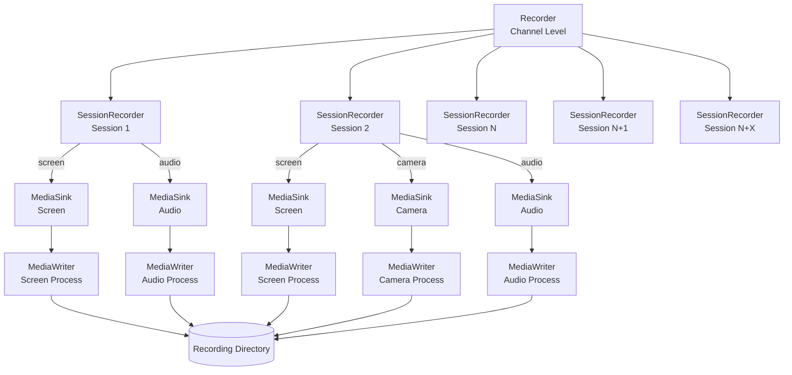

# Recording

see [recording/\*](../src/recording) for more details.

The SFU can record streams from a channel (depending on permissions and SFU setup).

Recording happens in two steps:

1. each streams is recorded in real time individually (the "raw recording").
2. later, the raw recordings are processed to produce one "combination" file.

The two phase approach allow for the real time part to be light (only writing packets to file, no transcoding), and then the compiling phase (composition/mixing and transcoding) can be done later with no real time constraint (so the heavy work can be done when the SFU is not under too much load).

Recording state contains the active `audio`, `video` and `transcription`
outputs. A recording is active when at least one output is active. Audio and
video remain fixed for the recording. Transcription may change while audio or
video remains active. `setRecording` preserves omitted flags and stops the
recording when the resulting output set is empty.

Starting requires at least two participants. A solo start returns `false` without
allocating recording resources. Recording stops with `channel_closed` when a
participant leaves one person behind.

## Architecture


```mermaid
flowchart TB

    R["Recorder <br> Channel Level"] ---> RT1["SessionRecorder <br> Session 1"] & RT2["SessionRecorder <br> Session 2"]
    R ---> RTN["SessionRecorder <br> Session N"] & RTN1["SessionRecorder <br> Session N+1"] & RTN0["SessionRecorder <br> Session N+X"]
    RT1 -- audio --> MSA1["MediaSink <br> Audio"]
    RT1 -- screen --> MSS1["MediaSink <br> Screen"]
    RT2 -- screen --> MSS2["MediaSink <br> Screen"]
    RT2 -- camera --> MSC2["MediaSink <br> Camera"]
    RT2 -- audio --> MSA2["MediaSink <br> Audio"]
    MSA1 --> FFA1["MediaWriter <br> Audio Process"]
    MSS1 --> FFS1["MediaWriter <br> Screen Process"]
    MSA2 --> FFA2["MediaWriter <br> Audio Process"]
    MSS2 --> FFS2["MediaWriter <br> Screen Process"]
    MSC2 --> FFC2["MediaWriter <br> Camera Process"]
    FFS1 --> DIR[("Recording Directory")]
    FFA1 --> DIR
    FFS2 --> DIR
    FFC2 --> DIR
    FFA2 --> DIR
```

### Components

1.  **Recorder (Channel Level)**
    Manages recording for an entire `Channel`.
    Handles the lifecycle of recording and holds the `SessionRecorder`s for current sessions and listens for new sessions joining the channel to create them dynamically.

2.  **SessionRecorder (Session Level)**
    Bound to a specific rtc `Session`.
    Monitors the user's producers (audio, camera, screen). When a user releases a stream (e.g., turns on camera), the `SessionRecorder` detects it and manages a `MediaSink` for each.

    -   **Inputs:** `audio`, `camera`, `screen` flags determine which streams to record.

3.  **MediaSink (Stream Level / RTP)**
    Handles a single stream type (e.g., just the camera) for a session.
    bridges the Mediasoup `Producer` (source) to the `MediaWriter` (ffmpeg) process (sink), and manages the lifecycle of the port, transport, consumer and ffmpeg process
    It also handles the "allowed"/"active" flags.

4.  **MediaWriter (Process Level)**
    Represents a single child process writing to a file.
    Receives RTP packets on a specified port and writes them to a file container. Essentially a wrapper to abstract ffmpeg.

## Output Structure

recordings are saved as `${timestamp}-${channelUUID}` inside `config.dir.recordings` (`${DATA_PATH}/recordings`)

```text
{timestamp}-{channelUUID}/
├── metadata.bin
├── audio/
│   └── {timestamp}-{sessionID}-{streamType}.webm
│   └── 1765292341216-987-audio.webm
│   └── 1765292441216-988-audio.webm
├── camera/
│   └── {timestamp}-{sessionID}-{streamType}.webm
│   └── 1765292341216-985-camera.mp4
│   └── 1765292341219-987-camera.webm
│   └── 1765292341219-987-camera.webm.log
└── screen/
    └── 1765292341216-987-screen.mp4
```

container extensions depend on the stream codec and `.log` files are written when `FFMPEG_LOGGING` is enabled

#### metadata file (`metadata.bin`)

the metadata is encrypted at rest because it contains routing data and the channel key

after decryption it contains the recording timeline and upload contract

```json
{
  "channelName": "discuss-channel-1234",
  "channelUUID": "e71d3571-60c8-4c4a-9c49-7686f9a24690",
  "routingAddress": "http://www.oodo.com/discuss/recording/routing/1234",
  "channelKey": "base64-channel-key",
  "userId": 42, // optional user that started the recording
  "audio": true,
  "video": true,
  "transcription": false,
  "startedAt": 1670000000000,
  "stoppedAt": 1670000060000,
  "timeStamps": [
    {
      "tag": "file_state_change",
      "timestamp": 1670000005000,
      "info": {
        "filename": "1670000005000-session-123-audio.webm",
        "type": "audio",
        "sessionId": "session-123",
        "active": true,
        "available": true
      }
    },
    ...
  ]
}
```

the first `file_state_change` with `active: true` marks the start of a file and the last event with `active: false` marks the end

timestamps are the source of truth because one file can span active and inactive periods without restarting FFmpeg

## scheduler service and post-processing

the scheduler scans finalized raw recordings sequentially and defers media processing while CPU load is high

### [scheduler service](../src/recording/services/scheduler.ts)

The scheduler manages CPU-load deferral, TTL cleanup and final folder removal.
Each recording gets one processing and delivery attempt. Before compilation,
`metadata.bin` is renamed to `metadata.bin.processing` so later scans cannot
replay delivery after a cleanup failure or process restart. Processing failures
discard the recording files, including when `FFMPEG_LOGGING` is enabled.
Successful recordings retain the existing debug-archive behavior.

### [media compiler](../src/recording/models/media_compiler.ts)

one compiler combines the raw streams for one recording into its final audio and video artifacts

#### upload

Transcription audio is posted to `${routingAddress}/transcribe`.

The authenticated session's optional `user_id` claim becomes `userId` in recording
metadata. The starter remains fixed when another session updates the recording.
Transcription, routing and completion JWTs carry that identity as `user_id`.
Guest sessions omit it. Deploy the Odoo and SFU identity changes together and
finish pending recordings before upgrading. Earlier `partnerId` metadata cannot
identify the initiating user and is not converted to `userId`.

For media, the uploader posts `start_ms`, `end_ms` and `mimetype` to
`${routingAddress}/routing` and uploads to the returned `destination` using its
`method`, `headers` and expected `response_status`. A destination-only response
keeps the default POST upload without a completion callback.

When routing returns `requires_completion: true`, the uploader waits for a
successful upload before posting `start_ms` and `end_ms` to
`${routingAddress}/complete`. Routing and completion use separate channel JWTs
so the completion token has not expired during a long upload. Odoo announces
availability only after completion. Transcription, routing, upload and completion
failures discard the recording without retrying any request.

Deploy the Odoo routing and completion changes together with this uploader.
Older Odoo routes may reject POST through CSRF protection. Updated Odoo routes
reject the GET requests from older SFUs, which do not send completion callbacks.
There is no GET fallback.
