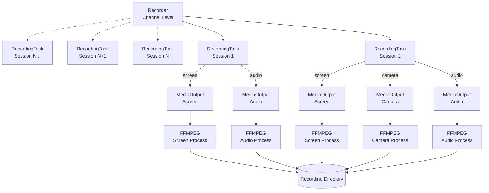

# Recording

The recording feature in the SFU allows for capturing audio, video from camera, and screen sharing streams from a channel. It is designed to handle each stream independently to produce raw recording files that can be processed later (e.g., for transcription, composition, or playback).

## Architecture

The recording architecture follows a hierarchical structure, managing resources from the channel level down to individual system processes.



### Components

1.  **Recorder (Channel Level)**
    *   **Scope:** Manages recording for an entire `Channel`.
    *   **Responsibility:** Orchestrates the lifecycle of recording. It initializes `RecordingTask`s for current sessions and listens for new sessions joining the channel to create tasks for them dynamically, based on the transcription and recording settings.

2.  **RecordingTask (Session Level)**
    *   **Scope:** Bound to a specific `Session` (a user connection).
    *   **Responsibility:** Monitors the user's producers (audio, camera, screen). When a user releases a stream (e.g., turns on camera), the `RecordingTask` detects it and delegates the recording logic to a `MediaOutput`.
    *   **Inputs:** `audio`, `camera`, `screen` flags determine which streams to record.

3.  **MediaOutput (Stream Level / RTP)**
    *   **Scope:** Handles a single stream type (e.g., just the camera) for a session.
    *   **Responsibility:** Bridges the Mediasoup `Producer` (source) to the `FFMPEG` process (sink), and manages the lifecycle of the port usage, transport, consumer, and ffmpeg process.

4.  **FFMPEG (Process Level)**
    *   **Scope:** Represents a single OS process writing to a file.
    *   **Responsibility:** Receives RTP packets on a specified port and writes them to a file container. Essentially a wrapper around the ffmpeg API.


## Settings & Environment Variables

The recording feature is configured via environment variables in `src/config.ts`.

| Variable           | Type    | Description                                                               | Default                    |
| :----------------- | :------ | :------------------------------------------------------------------------ | :------------------------- |
| `RECORDING`        | boolean | Master switch to enable/disable the recording feature.                    | `false`                    |
| `RECORDING_PATH`   | string  | Directory where the raw recordings are saved.                             | `/tmp/odoo_sfu/recordings` |
| `DYNAMIC_MIN_PORT` | number  | Start of the port range for internal RTP routing (MediaOutput -> FFMPEG). | `50000`                    |
| `DYNAMIC_MAX_PORT` | number  | End of the port range for internal RTP routing.                           | `59999`                    |

**Important Note:** The `DYNAMIC_MIN_PORT` and `DYNAMIC_MAX_PORT` range **MUST NOT** overlap with the `RTC_MIN_PORT` and `RTC_MAX_PORT` range used for client connections.

## Output Structure

Recordings are saved in a directory named `{channelName}_{timestamp}` inside `RECORDING_PATH`.

```text
{channelName}_{timestamp}/
├── metadata.json
├── audio/
│   └── ...
├── video/
│   └── ...
└── screen/
    └── ...
```

#### Contents:
*   **metadata.json:** Top-level metadata file containing timestamps and upload info.
*   **audio/:** Folder containing all audio stream recordings.
*   **video/:** Folder containing all camera stream recordings.
*   **screen/:** Folder containing all screen sharing stream recordings.

#### Metadata File (`metadata.json`)

Contains the timestamps of the recording, and the address to which the file should be uploaded to.

```json
{
  "forwardAddress": "http://...",
  "timeStamps": [
    {
      "tag": "recording_started",
      "timestamp": 1670000000000
    },
    {
      "tag": "file_state_change",
      "timestamp": 1670000005000,
      "info": {
        "filename": "session-123-audio-167...webm",
        "type": "audio",
        "active": true
      }
    },
    ...
  ]
}
```
The first occurence of `file_state_change` with `active: true` marks the start of a file, and the last one with `active: false` marks the end, 
each file can have any arbitrary amount of state changes, when not active the content is essentially empty but the inner timestamps are still being marked.
