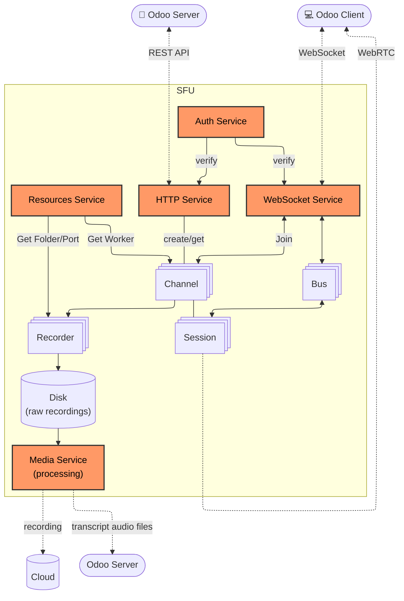
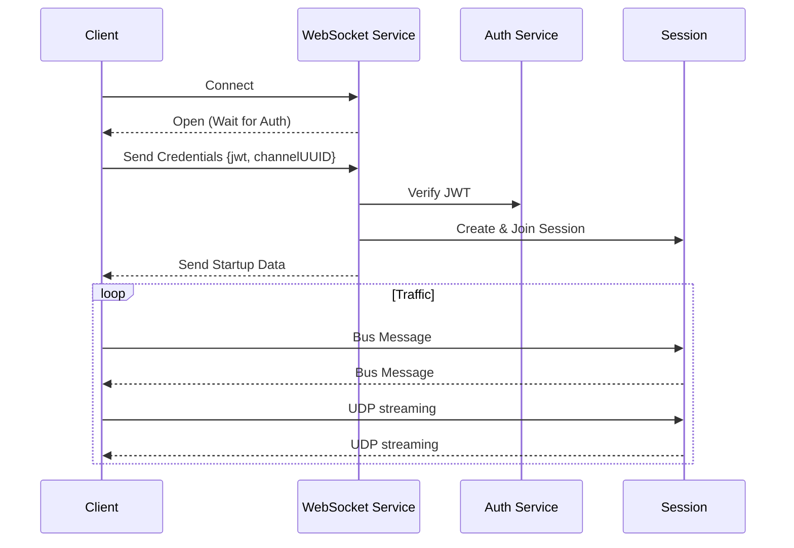

# Services

This directory contains the core infrastructure services that power the SFU. These services manage network protocols, authentication, and system resources.

## Overview

## Service Modules

### 1. Auth Service (`auth.ts`)

The Authentication service is responsible for the security of the application. It handles the signing and verification of JSON Web Tokens (JWT).

### 2. HTTP Service (`http.ts`)

The HTTP service provides the REST API for the SFU. It handles channel creation, status checks, and session management.

**Key Endpoints:**

| Method | Endpoint         | Description                                         |
| ------ | ---------------- | --------------------------------------------------- |
| `GET`  | `/v1/channel`    | Creates or retrieves a media channel. Requires JWT. |
| `POST` | `/v1/disconnect` | Disconnects specific sessions from a channel.       |
| `GET`  | `/v1/stats`      | Returns statistics for all active channels.         |
| `GET`  | `/v1/noop`       | Health check endpoint.                              |

### 3. WebSocket Service (`ws.ts`)

The WebSocket service manages real-time, persistent connections with clients. It is the primary transport for signaling data once a session is established.

### 4. Resources Service (`resources.ts`)

The Resources service acts as the interface to the underlying system and Mediasoup library. It manages the pool of worker processes and system resources.

**Responsibilities:**
- **Worker Management**: Maintains a pool of Mediasoup workers. Automatically replaces workers if they crash.
- **Load Balancing**: `getWorker()` returns the worker with the lowest memory usage (`ru_maxrss`).
- **File System**: Manages temporary folders for recordings via the `Folder` class.
- **Port Management**: Allocates dynamic ports for media transport using the `DynamicPort` class.

### 5. Media Service (`media.ts`)

The Media service is responsible for the processing and dispatching of media files and the scheduling of these tasks.